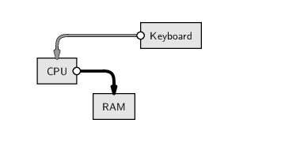

# (PART) R básico {-}

# Computação científica e interação com o R

## Interagindo com o computador

O que significa este ícone?

```{r, out.width='50%', echo=FALSE}
knitr::include_graphics("img/excelcsvgrey.png")
```

- É um documento do Microsoft Excel?
- É um arquivo de **texto pleno**, separado por vírgulas (CSV *comma
  separated values*)
- De fato, o nome do arquivo é `final.csv` e não `final`
- O Excel pode sim abrir este arquivo... assim como milhares de outros
  programas!

O que está acontecendo?

- O computador (leia-se, nesse caso, o sistema operacional Windows)
  "proteje" o usuário dos detalhes sujos
- Isso é ruim? **Sim!**
- O usuário se acostuma com o computador ditando as regras
- É importante lembrar que é você quem deve dizer o que o computador
  deve fazer (nesse caso, com qual programa abrir certo arquivo)

O que deve acontecer?

- Para a maioria dos usuários, a interação com o computador se limita a
  clicar em links, selecionar menus e caixas de diálogo
- O problema com essa abordagem é que parece que o usuário é controlado
  pelo computador
- A verdade deve ser o oposto!
- É o usuário que possui o controle e deve dizer para o computador
  exatamente o que fazer
- Escrever código ainda tem a vantagem de deixar registrado tudo o que
  foi feito

## Editores de texto

Uma característica importante de códigos de programação é que eles são
em **texto puro**, por isso precisamos de um bom **editor de textos**

Características de um bom editor:

- **Identação automática**
- **Complementação de parênteses**
- **Destaque de sintaxe** (*syntax highlighting*)
- **Numeração de linhas**
- **Auto completar comandos**

### Editores para R

Windows:

- Interface padrão: pouco recomendado
- Tinn-R

Linux:

- Vim-R-plugin
- Gedit-R-plugin

Todas as plataformas:

- Rstudio: recomendado para iniciantes
- Emacs + ESS: altamente recomendado

## R

> *"The statistical software should help, by supporting each step from
> user to programmer, with as few intrusive barriers as possible."*

> *"... to turn ideas into software, quickly and faithfully."*

--- John M. Chambers

O R é um dialeto do S e:

- *Ambiente* estatístico para análise de dados e produção de gráficos
- Uma completa linguagem de programação:
	- Interpretada (contrário de compilada)
	- Orientada a objetos:

	*Tudo no R é um objeto...*

- Livre distribuição (código-aberto)
- Mais de 10000 pacotes adicionais

Pequeno histórico:

- 1980: Linguagem S: desenvolvida por R. Becker, J. Chambers e A. Wilks
(AT&T Bell Laboratories)
- 1980: Versão comercial: S-Plus (Insightful Corporation)
- 1996: Versão livre: R desenvolvido por R. Ihaka e R. Gentleman
(Universidade de Auckland)
- 1997: R Development Core Team
- Hoje: 20 desenvolvedores principais e muitos outros colaboradores em
todo o mundo
- Estatísticos, matemáticos e programadores

### Configuração inicial

- O **diretório de trabalho** é uma pasta onde o R será
  direcionado. Todos os arquivos que serão importados (base de dados,
  ...) ou exportados (base de dados, gráficos, ...) por ele
  ficarão nesta pasta.
- Existem duas maneiras de configurar o
  diretório de trabalho (suponha que vamos usar a pasta
  `~/estatcomp1`):

- `1)` Utilizando a função `setwd()` dentro do R:
```{r, eval=FALSE}
setwd("~/estatcomp1")
```

- `2)` Pelo menu do RStudio em `Session > Set Working Directory > Choose Directory...`
Confira o diretório que está trabalhando com a função
```{r, eval=FALSE}
getwd()
```

### O R como uma calculadora

O símbolo `>` indica que o R está pronto para receber um comando:
```{r, prompt=TRUE, comment=NA}
2 + 2
```
O símbolo `>` muda para `+` se o comando estiver incompleto:
```{r, prompt=TRUE, tidy=FALSE, comment=NA}
2 *
2
```
Espaços entre os números não fazem diferença:
```{r, prompt=TRUE, comment=NA}
2+         2
```

### Para onde vão os resultados?

```{r, prompt=TRUE, comment=NA}
1 + 3 + 5 + 7
```

```{r, echo=FALSE, out.width='50%'}
knitr::include_graphics("img/script-commandline.png")
```

```{r, echo=FALSE, out.width='50%'}
knitr::include_graphics("img/script-commandlinedata.png")
```

- Note que o resultado é apenas mostrado na tela, nada é salvo na
  memória (por enquanto)

### O editor de scripts

- Para criar rotinas computacionais é necessário utilizar um editor
    de scripts.
- Clique em `File > New file > R script`. Salve com a extensão
    `.R`.
- Para enviar comandos diretamente para o console, selecione-os e
    aperte `Ctrl + <Enter>`.
- Para adicionar comentários ao script, utiliza-se o símbolo
    `#` antes do texto e/ou comandos. O que estiver depois do
    símbolo não será interpretado pelo R. Portanto:
```{r, eval=FALSE}
2 + 2     # esta linha será executada
# 2 + 2     esta linha não será executada
```

### Operadores aritméticos

Operador | Significado
-------- | -----------
`+` | adição
`-` | subtração
`*` | multiplicação
`/` | divisão
`^` | potência
`exp()` | exponencial
`sqrt()` | raíz quadrada
`factorial()` | fatorial
`log()`; `log2()`; `log10()` | logaritmos

### Ordens de execução

As operações são realizadas sempre seguindo as prioridades:

1. De dentro para fora de parênteses `()`
2. Multiplicação e divisão
3. Adição e subtração

```{r, prompt=TRUE, comment=NA}
5 * 2 - 10 + 7
5 * 2 - (10 + 7)
5 * (2 - 10 + 7)
5 * (2 - (10 + 7))
```

### Exercícios {-}

1. Calcule a seguinte equação: $32 + 16^2 - 25^3$
2. Divida o resultado por $345$
3. Qual o resultado da expressão $\frac{e^{-2}  2^{4} - 1}{4!}$?
4. E do logaritmo desta expressão?

### "Salvando" resultados

Do exercício anterior

```{r, prompt=TRUE, comment=NA}
x <- 32 + 16^2 - 25^3
x
x/345
(y <- (exp(-2) * 2^4 - 1)/factorial(4))
log(y)
```

Quando criamos uma variável (`x`, `y`), ela fica armazenada
**temporariamente** na memória RAM.

```{r, echo=FALSE, out.width='50%'}

```

Para saber quais objetos estão criados, usamos a **função** `ls()`

```{r, prompt=TRUE, comment=NA}
ls()
```

Estas variáveis ficam armazenadas no chamado *workspace* do R

- O *workspace* consiste de tudo que or criado durante uma sessão do R,
  armazenado na memória RAM

Para efetivamente salvar esas variáveis, podemos armazenar esse *workspace*
do R em disco, em um arquivo chamdo `.Rdata`

```{r, echo=FALSE, out.width='50%'}
knitr::include_graphics("img/script-workspace.png")
```
```{r, echo=FALSE, out.width='50%'}
knitr::include_graphics("img/script-workspacedata.png")
```

- Quando o R é iniciado em um diretório com um arquivo `.Rdata`, as
  variáveis salvas são automaticamente carregadas
- No entanto, é sempre melhor salvar os dados e o **script**, assim é
  possível gerar os resultados novamente, sem salvar nada sem
  necessidade
- Veremos mais pra frente como salvar variáveis específicas, por
  exemplo, resultados de uma análise que leva muito tempo para ser
  executada
- O mais importante é salvar o **código**, assim sabemos **como**
  chegamos a determinado resultado, e podemos recriá-lo depois

### Finalizando o programa

A qualquer momento durante uma sessão você pode usar o comando
```{r, prompt=TRUE, eval=FALSE}
save.image()
```

No RStudio:

- `File > Save As...`
- Na janela que abrir, digite o nome do arquivo (por exemplo
  `script_aula1`) e salve
- Automaticamente o script será salvo com a extensão `.R`
  (nesse caso `script_aula1.R`) no diretório de trabalho que você
  configurou no início

Alternativamente, você pode também salvar toda sua área de trabalho,
clicando em `Workspace > Save As Default Workspace`. Este
processo irá gerar dois arquivos:

- `.Rdata`: contém todos os objetos criados durante uma
  sessão. Não é necessário (e nem recomendado) dar um nome antes do
  ponto. Dessa forma, a próxima vez que o programa for iniciado neste
  diretório, a área de trabalho será carregada automaticamente.
- `.Rhistory`: um arquivo texto que contém todos os comandos
  que foram digitados no console.

<!-- ## Layout de código -->

<!-- ## Formatos de arquivos -->

<!-- ### Texto pleno -->

<!-- ### CSV -->

<!-- ### Encoding -->

## Referências {-}

* Leek, J. [The Elements of Data Analytic Style][datastyle]. Leanpub, 2015.
* Murrell,
  P. [Introduction to data technologies](https://www.stat.auckland.ac.nz/~paul/ItDT/HTML). Boca
  Raton: Chapman & Hall/CRC, 2009.
* Peng,
  RD. [R programming for data science](https://leanpub.com/rprogramming). Leanpub, 2015.

[dados]: http://simplystatistics.org/2013/12/12/the-key-word-in-data-science-is-not-data-it-is-science/
[RNYT]: http://www.nytimes.com/2009/01/07/technology/business-computing/07program.html?pagewanted=all&_r=0
[DSVD]: http://drewconway.com/zia/2013/3/26/the-data-science-venn-diagram
[datastyle]: https://leanpub.com/datastyle
