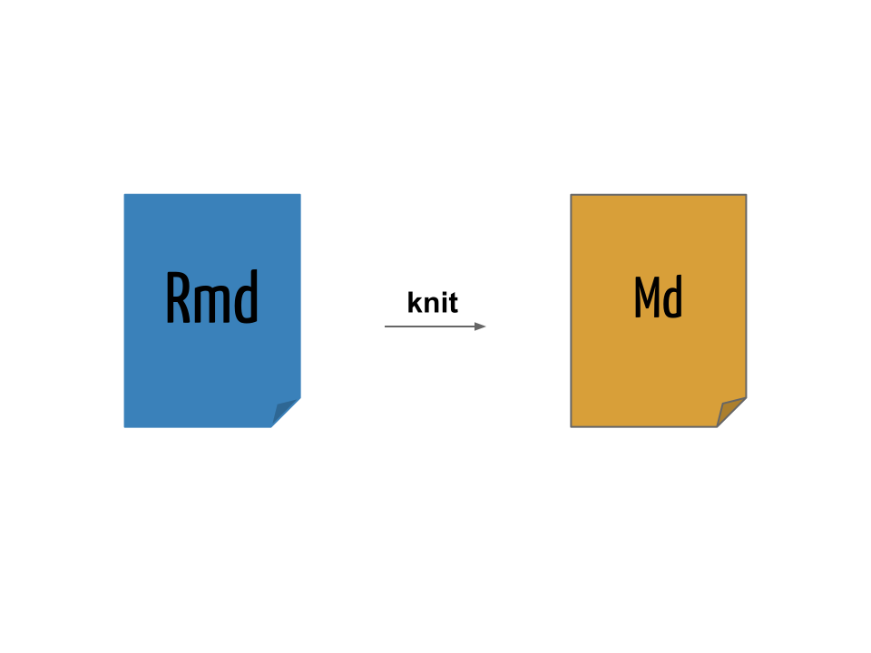

# (APPENDIX) Apêndice {-}

# Documentos dinâmicos

```{r, cache=FALSE, include=FALSE}
options(knitr.duplicate.label = "allow")
```

A ideia geral de um documento dinâmico é a de que ele pode ser gerado a
partir de um **código-fonte**:

- Da mesma forma que um *software* possui seu código-fonte, um documento
  dinâmico é o código-fonte de um relatório.
- É uma combinação de código de computador e as correspondentes
  narrativas descrevendo o resultado que o código está gerando (números,
  tabelas, figuras, ...).
- Quando **compilamos** o documento dinâmico, o código de computador é
  executado, e as saídas são apresentadas. Portanto obtemos um documento
  final que mistura **código** e **texto**.

Como gerenciamos apenas o código-fonte do documento, ficamos livres de
etapas manuais como ter que refazer um gráfico ou uma tabela após
qualquer alteração na análise.

## Literate Programming

> *Instead of imagining that our main task is to instruct a computer what
> to do, let us concentrate rather on explaining to humans what we want
> the computer to do.*
>
> > Donald Knuth

O ideia básica por trás de documentos dinâmicos decorre diretamente do
conceito de *literate programming* ("programação letrada"), um paradigma
concebido por [Donald Knuth][] em 1984.

<table>
<tr>
<td align="center"></td>
<td align="center"></td>
</tr>
</table>

O objetivo da *literate programming* é criar um documento que
"entrelaça" (mistura) texto e código. O texto é legível para humanos e o
código é legível para máquinas. A análise é descrita em uma série de
texto e blocos de código (*code chunks*). Cada bloco de código irá
executar uma etapa da análise, e estará diretamente associado ao texto
explicativo acima ou abaixo do bloco.

<!-- - O conceito é o de misturar **literatura** (o texto em uma -->
<!--   linguagem humana) com **códigos de programação**, tornando claro cada -->
<!--   etapa de um programa e/ou análise -->

O processo de *literate programming* ocorre em duas vias, chamadas de
**weaving** e **tangling**. O importante é que, **com um único
código-fonte** podemos:

- Produzir documentos para humanos (HTML, PDF, ...) $\Rightarrow$ *weave*
- Produzir "documentos" (*scripts*) para máquinas (código) $\Rightarrow$
  *tangle*

Para podermos usar um sistema como esse, é necessário então uma
linguagem de documentação para humanos (*e.g.* LaTeX ou Markdown), e
uma linguagem de programação que será compilada com o documento (*e.g.*
R ou Python).

Knuth criou inicialmente um sistema chamado **WEB** para fazer essa
mistura dos seus textos em $TeX$ com a linguagem Pascal. Atualmente
muitos outros sistemas existem para misturar códigos com texto em várias
linguagens de documentação e de programação.

## Literate Programming no R

Com a ascensão do R no início dos anos 2000, [Friedrich Leisch] criou
o [Sweave] em 2002

- S + weave
- Permite "entrelaçar" textos do LaTeX com códigos do R
- Ainda é muito utilizado e já é distribuído como uma função do R
  dentro do pacote `utils`

No final de 2011, [Yihui Xie] criou o pacote [knitr] como uma extensão
do Sweave, e com a proposta de ser mais flexível, fácil e **preparado
para a Web**. Segundo o próprio autor, o knitr é resultado dessa
equação:

```{r, eval=FALSE}
knitr = Sweave + cacheSweave + pgfSweave + weaver +
    animation::saveLatex + R2HTML::RweaveHTML +
    highlight::HighlightWeaveLatex + 0.2 * brew +
    0.1 * SweaveListingUtils + more
```

Resumidamente, o knitr possui as seguintes vantagens sob o Sweave:

- knit + R
- Uma re-implementação mais moderna do Sweave
- Permite "entrelaçar" textos do LaTeX, HTML e **Markdown** com
  códigos do R
- Também permite misturar texto com códigos de **outras linguagens**:
  Python, awk, C++, shell.
- Adiciona muitas facilidades como
	- Cache
	- Decoração e formatação automática de códigos
	- Geração de gráficos mais direta

Podemos fazer uma comparação entre arquivos LaTeX escritos em Sweave
e knitr. Exemplos simples podem ser vistos nos arquivos
[Exemplo0-Sweave.Rnw](exemplos/Exemplo0-Sweave.Rnw) escrito com Sweave e
[Exemplo0-knitr.Rnw](exemplos/Exemplo0-knitr.Rnw) escrito com a sintaxe
do knitr. Para compilar estes documentos, usamos

```{r comp, eval=FALSE}
Sweave("Exemplo0-Sweave.Rnw")
library(knitr)
knit("Exemplo0-knitr.Rnw")
```

Posteriormente, os arquivos `.tex` gerados podem ser compilados com
qualquer distribuição LaTeX, (*e.g* TeXLive, MikTeX), por exemplo

```{sh latex, eval=FALSE}
pdflatex Exemplo0-Sweave.Rnw
pdflatex Exemplo0-knitr.Rnw
```

Os resultados podem ser vistos nos respectivos arquivos:
[Exemplo0-Sweave.pdf](exemplos/Exemplo0-Sweave.pdf) e
[Exemplo0-knitr.pdf](exemplos/Exemplo0-knitr.pdf)

## Markdown

Segundo o próprio criador da linguagem:

> *Markdown is a text-to-HTML conversion tool for web writers. Markdown
> allows you to write using an easy-to-read, easy-to-write plain text
> format, then convert it to structurally valid XHTML (or HTML).*
>
> > John Gruber

- [Markdown] é uma [linguagem de marcação] simples para escrever
  textos
- O texto pode ser lido sem nenhum processamento, ou seja, da maneira
  como está escrito
- Outras linguagens de marcação como HTML e LaTeX requerem um grande
  número de *tags* para formatar o texto, muitas vezes dificultando a
  leitura do código-fonte
- A proposta do Markdown é que o escritor se concentre no texto e não na
  formatação
- Pode ser convertido para **vários outros formatos** além de HTML

### Sintaxe do Markdown

A sintaxe do Markdown é muito simples, e pode ser resumida da seguinte
forma:

#### Cabeçalhos {-}

```
# Título
## Sub-título
### Sub-sub-título
```

#### Itálico {-}

```
*Este texto aparecerá em itálico.*
```

*Este texto aparecerá em itálico.*

#### Negrito {-}

```
**Este texto aparecerá em negrito.**
```

**Este texto aparecerá em negrito.**

#### Listas não-ordenadas {-}

```
- Primeiro item
- Segundo item
- Terceiro item
```

- Primeiro item
- Segundo item
- Terceiro item

#### Listas ordenadas {-}

```
1. Primeiro item
2. Segundo item
3. Terceiro item
```

1. Primeiro item
2. Segundo item
3. Terceiro item

#### Sub-listas {-}

Utilize 4 espaços para criar uma sub-lista:

```
1. Primeiro item
	- Um sub-item
    - Outro sub-item
2. Segundo item
3. Terceiro item
```

1. Primeiro item
    - Um sub-item
    - Outro sub-item
2. Segundo item
3. Terceiro item

#### Links {-}

Links para endereços Web podem ser inseridos com `[texto](link)`:

```
O criador do conceito de "literate programming" foi
[Donald Knuth](https://en.wikipedia.org/wiki/Donald_Knuth).
```

O criador do conceito de "literate programming" foi
[Donald Knuth](https://en.wikipedia.org/wiki/Donald_Knuth).

```
Devemos instalar o pacote [knitr](http://yihui.name/knitr) para poder
usar o R Markdown.
```

Devemos instalar o pacote [knitr](http://yihui.name/knitr) para poder
usar o R Markdown.

#### Imagens {-}

Para inserir uma imagem, a sintaxe é a mesma de inserir um link, mas com
uma exclamação (`!`) na frente: ``.

O link para a imagem pode ser um enderço Web:

```

```


Ou um endereço local:

```

```


#### Parágrafo {-}

Para criar parágrafos basta pular uma linha:

```
O criador do conceito de "literate programming" foi
[Donald Knuth](https://en.wikipedia.org/wiki/Donald_Knuth).

Devemos instalar o pacote [knitr](http://yihui.name/knitr) para poder
usar o R Markdown.
```

O criador do conceito de "literate programming" foi
[Donald Knuth](https://en.wikipedia.org/wiki/Donald_Knuth).

Devemos instalar o pacote [knitr](http://yihui.name/knitr) para poder
usar o R Markdown.

#### Códigos {-}

Para apresentar códigos na própria linha, colocamos o texto entre duas
crases (` ` `):

```
Para gerar números aleatórios de uma distribuição normal no R, use a
função `rnorm()`.
```

Para gerar números aleatórios de uma distribuição normal no R, use a
função `rnorm()`.

Para apresentar blocos de código, coloque o texto entre três crases
seguidas (` ``` `) no início e no final. O bloco

    ```
	x <- rnorm(n = 10, mean = 100, sd = 5)
	hist(x, main = "")
    ```

Irá gerar

```
x <- rnorm(n = 10, mean = 100, sd = 5)
hist(x, main = "")
```

Note que esse código não será interpretado, ele apenas será mostrado no
texto. Esse será o papel do R aqui mais adiante!

#### Tabelas {-}

Tabelas podem ser escritas da seguinte forma:

```
    Caracter | Permissão
    ---------|----------
    `r`      | Permissão de leitura (*read*)
    `w`      | Permissão de escrita (*write*)
    `x`      | Permissão de execução (*execute*)
    `-`      | Permissão desabilitada
```

Para gerar o seguinte resultado:

Caracter | Permissão
---------|----------
`r`      | Permissão de leitura (*read*)
`w`      | Permissão de escrita (*write*)
`x`      | Permissão de execução (*execute*)
`-`      | Permissão desabilitada

#### Equações matemáticas {-}

Equações matemáticas podem ser escritas em formato LaTeX. A página
HTML resultante irá renderizar as equações através do [MathJax].

Equações na própria linha podem ser inseridas entre `$`:

```
Um modelo de regressão linear simples:  $Y = \beta_0 + \beta_1 x + \epsilon$.
```

Um modelo de regressão linear simples: $Y = \beta_0 + \beta_1 x +
\epsilon$.

Equações podem ser exibidas entre `$$` para ficarem centralizadas em uma
linha própria:

```
$$
f(x;\mu,\sigma^2) = \frac{1}{\sigma\sqrt{2\pi}}
e^{ -\frac{1}{2}\left(\frac{x-\mu}{\sigma}\right)^2 }
$$
```

$$
f(x;\mu,\sigma^2) = \frac{1}{\sigma\sqrt{2\pi}}
e^{ -\frac{1}{2}\left(\frac{x-\mu}{\sigma}\right)^2 }
$$

### Escrevendo um documento em Markdown

Um documento Markdown possui a extensão `.md` (embora não seja a única
possível).

Veja o arquivo de exemplo [Exemplo1.md](exemplos/Exemplo1.md):

```{r, echo=FALSE, comment=NA}
cat(system("cat exemplos/Exemplo1.md", intern = TRUE), sep = "\n")
```

Para converter um documento Markdown em HTML (ou outro formato) é
necessário um **conversor**. O conversor padrão do Markdown é escrito em
Perl, e pode ser integrado em diversas ferramentas, mas não é apropriado
para usuários comuns. Para testar a conversão do documento, copie e cole
na página do [Dingus].

## Pandoc

O [Pandoc][] é um conversor extremamente versátil, capaz de converter
diversos formatos, incluindo Markdown para HTML.

Se o Pandoc estiver instalado no seu sistema (Unix) é possível
converter o documento na linha de comando (shell) com

```{sh, eval=FALSE}
pandoc -f markdown -t html Exemplo1.md -o Exemplo1.html
```

O pacote `knitr` possui a função `pandoc()` que é um *wrapper* para
executar o programa `pandoc` no sistema.

```{r, eval=FALSE}
pandoc(input = "exemplos/Exemplo1.md", format = "html")
```

Em ambos os casos, o resultado pode ser visualizado ao abrir o arquivo
[Exemplo1.html](exemplos/Exemplo1.html) no navegador.

## Documentos dinâmicos com Markdown e R

No exemplo anterior, escrevemos um documento em Markdown (`.md`) e
inserimos códigos do R, que são apenas apresentados no documento final.
Desse forma temos um documento **estático**, pois os códigos não são
interpretados. Para fazermos esse documento ser **dinâmico**, vamos usar
o pacote **knitr** a nosso favor, fazedo com que ele interprete e
retorne resultados dos códigos que inserimos. Vamos denominar
genericamente essa combinação de texto em Markdown e códigos do R de "R
Markdown".

Arquivos escritos em R Markdown não podem ser compilados usando
ferramentas padrão de conversão de Markdown. O código R deve ser
avaliado antes da conversão usando o Pandoc, por exemplo. R Markdown
pode ser convertido para Markdown através do knitr. Os resultados de
códigos do R são inseridos entre o texto em Markdown, que pode então ser
convertido para HTML (ou outros formatos) usando o Pandoc.

O uso do R Markdown para criar documentos dinâmicos tem se tornado uma
ferramenta chave atualmente em *literate statistical programming*, e
substituiu largamente ferramentas anteriores como o Sweave.

Os detalhes e opções do pacote knitr serão descritas mais adiante. Por
enquanto, o que precisamos fazer para tornar esse documento dinâmico é
alterar a extensão do arquivo de `.md` para `.Rmd`, e alterar a forma
dos blocos de código. Os blocos de códigos (ou *chunks*) agora devem
conter uma marcação especial para indicar que devem ser interpretados
pelo R, através do knitr. Para isso, colocamos `{r}` no início de cada
bloco, que agora ficam

    ```{r}`r ''`
    x <- rnorm(30)
    ```

Usando o mesmo exemplo anterior, vamos renomear o arquivo `Exemplo1.md`
para `Exemplo1-knitr.Rmd` e incluir a marção `{r}` nos blocos de código.

Também é possível colocar códigos do R para serem renderizados na
própria linha de texto com `` `r inline_expr('')` ``. Por exemplo,
`` `r inline_expr('2+2')` `` gera o resultado `r 2+2` no documento.

Veja o arquivo [Exemplo1-knitr.Rmd](exemplos/Exemplo1-knitr.Rmd).

```{r sys1, echo=FALSE, comment=NA}
cat(system("cat exemplos/Exemplo1-knitr.Rmd", intern = TRUE), sep = "\n")
```

Agora usamos o knitr, através da função `knit()` para compilar o
documento `.Rmd` em um documento com sintaxe Markdown `.md`

```{r sys2, comment=NA}
knit("exemplos/Exemplo1-knitr.Rmd", output = "exemplos/Exemplo1-knitr.md")
```

```{r, echo=FALSE, out.width='80%'}

```

O resultado da compilação pode ser vista no arquivo
[Exemplo1-knitr.md](exemplos/Exemplo1-knitr.md).

```{r sys3, echo=FALSE, comment=NA}
cat(system("cat exemplos/Exemplo1-knitr.md", intern = TRUE), sep = "\n")
```

Agora temos um documento em Markdown com os códigos do R avaliados. Mas
ainda precisamos processar esse arquivo para gerar o arquivo `.html`
através do Pandoc

```{r pandoc1}
pandoc(input = "exemplos/Exemplo1-knitr.md", format = "html")
```

que gera o arquivo
[Exemplo1-knitr.html](exemplos/Exemplo1-knitr.html) que pode
ser visualizado no navegador.

## R Markdown e knitr

O pacote knitr, como já mencionado, é uma combinação de várias ideias
desenvolvidas separadamente em pacotes do R para *literate programming*,
especialmente o Sweave. Este pacote suporta LaTeX, Markdown e HTML
como **linguagem de documentação**, e algumas linguagens de programação,
além do R, como por exemplo shell e Python. O resultado destes
documentos pode ser exportado para PDF, HTML, ou até mesmo arquivos do
MS Word. Daqui em diante, o nosso foco será no uso do knitr com Markdown
e R, pela simplicidade e versatilidade dessa linguagem, gerando
documentos dinâmicos em HTML. No entanto, a maioria das opções e o
funcionamento geral do pacote é similar para LaTeX (e compilação para
PDF) e HTML.

Na seção anterior, nós criamos um arquivo com a extensão `.Rmd`, que é
apropriada para documentos escritos em Markdown com R. Nós também usamos
as funções `knitr()` para converter o documento para Markdown, e
posteriormente a função `pandoc()` para gerar o HTML resultante.
Esse é o processo básico para gerar documentos dinâmicos no R. No
entanto, podemos estender esse processo para incorporar mais controle
tanto sob os códigos que são gerados, quanto na apresentação do
documento final.

Para facilitar a criação de documentos dinâmicos no R, a equipe do
RStudio desenvolveu o pacote [rmarkdown], que é baseado no knitr e
Pandoc, e contém opções padrão para gerar documentos em vários formatos
de maneira mais aprimorada.

A principal função para gerar documentos em R Markdown do pacote
rmarkdown é a `render()`. A função `render()` é uma *wrapper* que
internamente chama a `knitr::knit()` e posteriormente converte o
documento para `.html` usando o Pandoc. A diferença é que, além de ser
um processo mais direto, a saída em formato HTML utiliza temas mais
amigáveis, como o Twitter Bootstrap, que possibilita grandes opções de
configuração mais avançada.

Para usar esse função você precisa:

1. Instalar o pacote `rmarkdown` com `install.packages("rmarkdown")`
2. Instalar o Pandoc no seu sistema

No RStudio, esse pacote já vem instalado, assim como uma versão embutida
do Pandoc.

Usando o exemplo anterior, vamos compilar o arquivo
[Exemplo2-knitr.Rmd](exemplos/Exemplo2-knitr.Rmd). O primeiro argumento
da função é o nome (e local) do arquivo, e o segundo argumento é o
formato de saída, que por padrão é HTML.

```{r rendex2}
library(rmarkdown)
render("exemplos/Exemplo2-knitr.Rmd",  output_format = "html_document")
```

```{r, echo=FALSE, out.width='80%'}
include_graphics("img/split_apply_combine.png")
```

E o resultado pode ser visto no arquivo
[Exemplo2-knitr.html](exemplos/Exemplo2-knitr.html).

No RStudio, esse processo todo pode ser feito pelo botão
<kbd>Knit<kbd>.

### Metadados

Uma opção interessante ao utilizar o Pandoc é incluir metados no formato
[YAML] (*Yet Another Markup Language*). Os metadados em YAML são
escritos em formato de lista aninhada, e o Pandoc usa essas informações
para incluir, por exemplo, título, autor, e data em um documento.

A opção mais importante para o `rmarkdown` é o campo `output`, que
permite especificar o formato desejado de saída, o mesmo especificado no
argumento `output_format =` da função `render()`.

Os metadados em YAML são colocados sempre no **início** de um documento,
e são delimitados por `---`. Um exemplo típico seria:


    ---
    title: "Meu primeiro documento em R Markdown"
    author: "Fernando Mayer"
    date: "Abril, 2018"
    output: html_document
    ---


Com isso, não é mais necessário especificar o argumento `output_format
=` na chamada da função `render()`.

Veja o arquivo [Exemplo1-yaml.Rmd](exemplos/Exemplo1-yaml.Rmd). Para
renderizar esse aquivo, usamos:

```{r rendex1y, comment=NA}
render("exemplos/Exemplo1-yaml.Rmd")
```

O resultado final pode ser visto no arquivo
[Exemplo1-yaml.html](exemplos/Exemplo1-yaml.html).

### Convertendo R Markdown para outros formatos

Por padrão, a função `render()` gera um arquivo `.html`, mas existem
outros formatos finais possíveis graças ao **Pandoc**.

O pacote `rmarkdown` possui uma série de formatos de saída, que possuem
os sufixos `_document` para documentos, e `_presentation` para
apresentações (slides). Alguns deles:

* Documentos:
    - `html_document`
    - `pdf_document`
    - `word_document`
* Apresentações:
    - `ioslides_presentation`
    - `slidy_presentation`
    - `beamer_presentation`

Podemos converter um documento em R Markdown para PDF com

```{r rendex1kp, eval=FALSE}
render("exemplos/Exemplo1-yaml.Rmd", output_format = "pdf_document")
```

O resultado é o arquivo
[Exemplo1-yaml.pdf](exemplos/Exemplo1-yaml.pdf). A função `render()`
usa o Pandoc para converter Markdown para LaTeX, e depois para PDF.

Um documento do Word pode ser gerado com

```{r rendex1kw, eval=FALSE}
render("exemplos/Exemplo1-yaml.Rmd", output_format = "word_document")
```

Para gerar [Exemplo1-yaml.docx](exemplos/Exemplo1-knitr.docx).

Apresentações em slides HTML podem ser geradas em diversos formatos, um
deles é o `ioslides`

```{r rendex1ki, eval=FALSE}
render("exemplos/Exemplo1-yaml.Rmd",
       output_format = "ioslides_presentation",
       output_file = "Exemplo1-yaml-ioslides.html")
```

Veja o resultado em
[Exemplo1-knitr-ioslides.html](exemplos/Exemplo1-knitr-ioslides.html).

Apresentações em Beamer também podem ser geradas com

```{r rendex1kb, eval=FALSE}
render("exemplos/Exemplo1-yaml.Rmd",
       output_format = "beamer_presentation",
       output_file = "Exemplo1-yaml-beamer.pdf")
```

Com resultado no arquivo
[Exemplo1-yaml-beamer.pdf](exemplos/Exemplo1-yaml-beamer.pdf).


### Opções do knitr

O pacote knitr possui diversas opções para controlar a saída dos
resultados de códigos do R. Estas opções funcionam igualmente em blocos
de código inseridos entre texto escrito em Markdown ou LaTeX.

Para controlar a saída de código de um único *chunk*, coloque as opções
individualmente

<pre><code>```{r, opt1=val1, opt2=val2}
# código
```</code></pre>

Para controlar globalmente **todos** os *chunks* de um documento, use a
função `knitr::opts_chunk$set()`:

<pre><code>```{r, echo=FALSE}
knitr::opts_chunk$set(opt1 = val1,
                      opt2 = val2
)
```</code></pre>

As opções mais importantes são:

- `eval = FALSE` para não avaliar o código, apenas mostrar
- `echo = FALSE` para não mostrar o código, apenas as saídas
- `results = "hide"` para não mostrar as saídas
- `warning = FALSE` e `message = FALSE` para suprimir as mensagens de
  aviso
- `fig.width = 5` and `fig.height = 5` para alterar o tamanho dos
  gráficos gerados pelo R (em polegadas)
- `out.width = "80%"` para dimensionar a largura dos gráficos
- `cache = TRUE` para armazenar os resultados, e evitar com que eles
  sejam executados todas as vezes que o documento é compilado

Tabelas podem ser também geradas automaticamente a partir de resultados
de funções do R. Para gerar uma tabela a partir de um objeto do R,
podemos usar a função `knitr::kable()`. Para isso, também é necesário
utilizar a opção `results = "asis"` no *chunk*, para que o resultado
seja tratado como texto  literal em Markdown.

<pre><code>```{r, results="asis"}
kable(head(iris))
```</code></pre>

```{r tab, results="asis", echo=FALSE}
kable(head(iris))
```

A lista completa de opções está em <http://yihui.name/knitr/options>.

Utilizando a opção `output:` um cabeçalho YAML, podemos informar mais de
um formato para ser **gerado ao mesmo tempo** pelo rmarkdown. Por
exemplo, para gerar documentos de saída em HTML e PDF, podemos
especificar


    ---
    title: "Meu primeiro documento em R Markdown"
    author: "Fernando Mayer"
    date: "Abril, 2018"
    output:
      html_document: default
      pdf_document: default
    ---


E compilar todos eles ao mesmo tempo com

```{r rendex1y2, eval=FALSE}
render("exemplos/Exemplo1-yaml2.Rmd", output_format = "all")
```

Veja [Exemplo1-yaml2.html](exemplos/Exemplo1-yaml2.html), e
[Exemplo1-yaml2.pdf](exemplos/Exemplo1-yaml2.pdf).

Existem ainda alguns outros formatos disponíveis pelo pacote
**rmarkdown**, que podem ser consultados
[aqui](https://rmarkdown.rstudio.com/formats.html). Para cada formato,
ainda existem diversas opções que podem ser modificadas através do YAML.
Estas opções podem ser conferidas nos links específicos de cada formato
na página citada anteriormente.

### Citações

Também é possível escrever documentos que com referências
bibliográficas. Isso é possível pois o Pandoc suporta arquivos
**BibTeX** (`.bib`), que é o formato padrão de armazenamento e
gerenciamento de referências no LaTeX.

Para isso, basta então especificar o arquivo `.bib` no YAML com a *tag*:

```
bibliography: referencias.bib
```

As citações são então feitas com `@<identificador>`. Veja o arquivo
[Exemplo3-knitr.Rmd](exemplos/Exemplo3-knitr.Rmd).

```{r rendex3, eval=FALSE}
render("exemplos/Exemplo3-knitr.Rmd", output_format = "all")
```

Dessa forma serão gerados 3 formatos diferentes: HTML, PDF e MS Word.
Note que o tema usado para o HTML (`journal`) é uma possibilidade entre
algumas disponíveis em https://bootswatch.com/.

### Extraindo código-fonte

Uma característica importante do **knitr** é a habilidade de extrair
somente o código R de um documento dinâmico (*tangle*). Muitas vezes
você só precisa do código e não do texto (e.g. para enviar para um
colaborador).

Para fazer isso, use a função `purl()`:

```{r, comment=NA}
purl("exemplos/Exemplo3-knitr.Rmd")
```

```{r, echo=FALSE}
file.rename("Exemplo3-knitr.R", "exemplos/Exemplo3-knitr.R")
```

Isso criará um script R [Exemplo3-knitr.R](exemplos/Exemplo3-knitr.R)
com apenas os códigos presentes nos *chunks* do documento.

### Outras linguagens

O R Markdown (por meio do pacote **knitr**) suporta também o uso de
outras linguagens diferentes do R, como:

- Python
- C (Rcpp)
- Fortran
- SQL
- awk
- ruby
- Haskell
- Bash
- Perl
- Dot
- tikz
- SAS
- Coffeescript

Para isso, basta mudar a *engine* (primeira definição do chunk) para a
linguagem desejada.

Exemplos do uso de diferentes *engines* podem ser consultadas
[aqui](https://yihui.name/knitr/demo/engines/). Este outro
[link](https://rmarkdown.rstudio.com/authoring_knitr_engines.html)
mostra mais alguns exemplos.

No arquivo [Exemplo-python.Rmd](exemplos/Exemplo-python.Rmd) pode-se ver
um exemplo de documento que mistura códigos em Python e R. Também é
utilizado o pacote
[feather](https://blog.rstudio.com/2016/03/29/feather/) do Python e do
R, para exportar/importar data frames de uma linguagem para outra dentro
do mesmo documento.

<!-- links -->

[Donald Knuth]: https://en.wikipedia.org/wiki/Donald_Knuth
[MathJax]: http://www.mathjax.org
[Dingus]: http://daringfireball.net/projects/markdown/dingus
[Markdown]: http://daringfireball.net/projects/markdown
[rmarkdown]: http://rmarkdown.rstudio.com
[Friedrich Leisch]: http://www.statistik.lmu.de/~leisch
[Sweave]: https://www.statistik.lmu.de/~leisch/Sweave
[Yihui Xie]: http://yihui.name/
[knitr]: http://yihui.name/knitr
[Pandoc]: http://pandoc.org/
[YAML]: http://yaml.org/
[linguagem de marcação]: https://pt.wikipedia.org/wiki/Linguagem_de_marcação/
